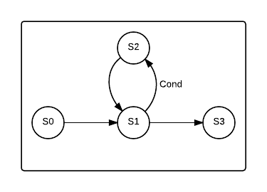

# Inline Assembly

Inline assembly is contained within normal solidity code and allows low-level access to the EVM.

The [official guide](http://solidity.readthedocs.org/en/latest/control-structures.html#inline-assembly) is a good reference, and it will be referenced throughout the text.

The examples here are created so that they can be loaded into the [browser compiler](https://chriseth.github.io/browser-solidity/) and run.

## Introduction (a simple add function)

The first example here will be a very simple function. It takes two uint params and adds them. We will use the simpler [functional style](http://solidity.readthedocs.org/en/latest/control-structures.html#functional-style) to begin with.

```
contract Adder {
    function add(uint a, uint b) constant returns (uint sum) {
        assembly {
            sum := add(a, b)
        }
    }
}
```

What happens here is basically this:

Before entering into the assembly block, it will push `a`, `b`, and `sum` onto the stack, as regular solidity variables. They are assigned their special stack position which will remain throughout the block. When accessed, they will be either dup'ed or swap'ed depending on if they are read from or written to.

In the assembly block, `b`, then `a` is copied and placed on top of the stack, the `ADD` instruction is run, and the `sum` variable is assigned that value.

Finally it will store `sum` in memory and pass the memory address and size to `RETURN`.

We can manually return inside of the assembly block if we want, like this:

```
contract Adder {
    function add(uint a, uint b) constant returns (uint) {
        assembly {
            mstore(0x0, add(a, b))
            return(0x0, 32)
        }
    }
}
```

Here we use `mstore` to store the sum of `a` and `b` at memory address 0x0. The reason we do that is because of how `RETURN` works; it takes two parameters: `return(memoryOffset, numBytes)`. We want to send 32 bytes, since that's the size of a `uint` (`uint` is shorthand for `uint256`).

## Instructional style

As is pointed out in the official guide, it is possible to use a regular, instructional style. This is the first unsigned integer adder written in the instructional style:

```
contract Adder {
    function add(uint a, uint b) constant returns (uint sum) {
        assembly {
            b a add =: sum
        }
    }
}
```

What's happening here is we're pushing `b` to the stack, then `a`, then `add`, which is essentially `add(a, b)`. It pops the numbers and puts the sum on the stack. To assign the value to the `sum` variable we need to use the reversed equals symbol `=:`, because the instructions are evaluated from left to right.

It is possible to mix the two styles:

```
contract Adder {
    function addTimesTwo(uint a, uint b) constant returns (uint sum) {
        assembly {
            add(a, b)
            dup1
            add
            =: sum
        }
    }
}
```

The above example will add `a` and `b`, duplicate the sum, then add the two sums. It is similar to doing this:

```
let s := add(a, b)
sum := add(s, s)
```

### Signed and unsigned integers.

Some instructions have special versions for working with signed integers. Here are two functions that does signed and unsigned integer division.

```
contract SignedDivider {
    function div(int a, int b) constant returns (int q) {
        assembly {
            q := sdiv(a, b)
        }
    }
}

contract UnsignedDivider {
    function div(uint a, uint b) constant returns (uint q) {
        assembly {
            q := div(a, b)
        }
    }
}
```

Calling `UnsignedDivider.div(4, -2)` will return `0`, because `-2` is in two's complement, so it's a huge number. Calling the signed division, on the other hand, will return `-2`.

## Stack, Memory and Storage Variables

No matter what the assembly in a function does, it may need to access things like function parameters, storage variables, or temporary variables declared outside of the assembly block. Accessing variables is done differently, depending on their type.

### Stack variables

Variables that are elementary, non-array, non-mapping types are created directly on the stack. This would be addresses, numbers, booleans and fixed-size `byteX` types.

All function parameters of these types will be put on the stack - both input and output parameters. They can also be created in function code, outside of the assembly, like normal. Additionally, they can also be declared within assembly code using `let`.

```
contract C {
    function f(uint n, bool b) constant returns (address addr) {
        uint x = 55;

        assembly {
                let sum := add(n, x)
                // Jump if 'n + x' is less then 100, or 'b' is true
                jumpi(skip_tag, or(b, lt(sum, 100)))
                // Otherwise, set 'addr' to the caller address.
                addr := caller
            skip_tag:
        }
    }
}
```

When reading a stack-declared variable, it will generally be `dup`ed, and writing means it will be `swap`ed. No memory is involved.

`let` is different from normal variable declarations in that they are only allowed to be one word in size, and have a different scope. In assembly you can use braces to create new scopes, like so:

```
contract C {
    function f() constant returns (uint ret) {
        // 'ret' will remain until function has returned.
        assembly {
            let x := 0 // Creates a stack item, keeps track of its index.
            let y := 5 // Same
            {
                let z := 17     // Creates another stack item.
                let y := 8      // local y overrides.
                x := add(y, z)  // 8 + 17
            }
            // z and nested y gone. Stack items popped.
            // y := z not possible
            ret := mul(x, y) // 25*5
        }
        // x and y both gone, stack items popped.
        return;
    }
}
```

### Memory Variables

Variables that are stored in memory or storage are pointers, and must be dereferenced using either `mload` or `sload` depending on the reference type.

```
contract C {
    function f(uint a) constant returns (uint[]) {
        uint[] memory arr = new uint[](3);
        arr[0] = a;
        arr[1] = 0x24;
        assembly {
            let len := mload(arr) // Length at first address.
            let arr0 := mload(add(arr, 32)) // Read first element.
            let arr1 := mload(add(arr, 64)) // Read second element.
            mstore(add(arr, 96), 7) // Write to element 3
        }
        return arr;
    }
}
```

It is of course possible to create arrays in assembly and return them:

```
contract C {
    function f(uint a, uint b) constant returns (uint[]) {
        assembly {
            // Create an dynamic sized array manually.
            let memOffset := mload(0x40) // 0x40 is the address where next free memory slot is stored in Solidity.
            mstore(memOffset, 0x20) // single dimensional array, data offset is 0x20
            mstore(add(memOffset, 32), 2) // Set size to 2
            mstore(add(memOffset, 64), a) // array[0] = a
            mstore(add(memOffset, 96), b) // array[1] = b
            return(memOffset, 128)
        }
    }
}
```

### Storage Variables

Storage variables can be more difficult to work with, especially arrays, since they may be packed. It is possible to reference storage variables from inline assembly, but doing so will push 2 items onto the stack - location and offset, so it must be done with care.

```
contract C {
    uint _a = 55; // Stored at storage-address 0x0

    function f() constant returns (uint a) {
        assembly {
            _a  // Adds 'address to _a', which is 0x0, then 'offset of _a', which is 0.
            pop // Remove offset.
            sload =: a
        }
    }
}
```

Packed storage data:

```
contract C {
    uint64 _a = 0x55;
    uint64 _b = 0x66;

    function f() constant returns (uint a, uint b) {
        uint s0;
        uint bOfs;
        assembly {
            _a pop // Pop the offset
            sload =: s0 // Store the address in s0
            a:= and(s0, 0xfffffffffffffff) // Value of '_a' is in the first 64 bits.
            _b =: bOfs pop // now keep offset in 'bOfs' and pop address (already know it's the same as for '_a')
            let bFact := exp(256, bOfs) // Factor for offsetting
            b := div(and(s0, mul(0xfffffffffffffff, bFact)), bFact) // Extract '_b'
        }
    }
}
```

Note that `sload(x)` isn't possible here since it puts two item on the stack, which is why the instructional style is mixed in.

It is also possible to access them directly using `sload`.

```
contract C {
    uint _a = 0x55; // Stored at storage-address 0x0

    function f() constant returns (uint a) {
        assembly {
            a := sload(0x0)
        }
    }
}
```

Packed storage data:

```
contract C {
    uint64 _a = 0x55; // Both are stored at storage-address 0x0
    uint64 _b = 0x66;

    function f() constant returns (uint a, uint b) {
        assembly {
            let s0 := sload(0x0) // Load storage address 0x0
            a := and(s0, 0xfffffffffffffff) // Get first 8 bytes
            b := div(and(s0, 0xfffffffffffffff0000000000000000), 0x10000000000000000) // Get next 8 bytes
        }
    }
}
```

### Calldata

Calldata is similar to memory, except it can't be written to. Single words can be read using `calldataload(address)`, just like `mload(address)` is used for memory. Calldata can also be copied to memory using `calldatacopy(memOffset, callDataOffset, numBytes)`.

It is important to know how calldata is formatted. The first four bytes are reserved for the method signature. This will cause some issues when reading arrays and such, since the location of their various components will be offset by 4.

```
contract C {
    function f(uint[] arr) constant external returns (uint len) {
        assembly {
            // address to length, offset by 4
            let lenAddr := calldataload(4)
            // offset address by 4, read, assign to 'len'
            len := calldataload(add(lenAddr, 4))
        }
    }
}
```

It is also possible to use the variables instead of calling `calldataload`. Something to remember is that two items will be added to the stack rather, position and length:

```
contract C {
    function f(uint[] arr) constant external returns (uint len) {
        assembly {
            arr =: len pop
        }
    }
}
```

As pointed out in the section on stack variables, value type parameters will always be copied onto the stack, and can both be read from and written to.

```
contract C {
    function f(uint a) constant returns (bool stackSame, bool txDataSame) {
        // We can work with 'a' in three ways - the variable, the stack
        // item, or read from calldata.
        assembly {
            let aFromStack := 0
            // Stack: [..., a, stackSame, txDataSame, aFromStack]
            dup4 =: aFromStack // set aFromStack to 'a'
            let aFromTxData := calldataload(4)
            stackSame := eq(aFromStack, a)
            txDataSame := eq(aFromTxData, a)
        }
    }
}
```

### Regular, external, internal, and private functions

If txdata is only going to be read, it is possible to mark the function as `external`. This will prevent variables from being copied into memory. This is a good optimization technique in some cases, especially when the txdata holds a large amount of data that will only be read.

Regular functions will copy reference types from calldata to memory.

```
contract C {
    function regular(uint[] arr) constant returns (uint[]) {
        if(arr.length == 0)
            return;
        arr[0] = 1; // Writable.
        return arr;
    }
}
```

Try adding `external` to the function and the assignment will fail (you will even get a compiler error saying that 'arr[0]' isn't an LValue).

Internal functions does not use calldata. It copies value-types like normal, and reference types as pointers to storage or memory.
```
contract C {
    function f(uint[] arr) constant returns (uint) {
        return _g();
    }

    function _g() constant internal returns (uint x) {
        assembly {
            x := calldataload(4) // Will read the '0x20' from array call-data every time, even though `_g` has no params.
        }
    }
}
```

`private` functions is the same as `internal` functions in this context.

### Loops

Loops are simple to create using `jump` and `jumpi`. This is a very simple function for multiplying two integers through repeated addition.

```
contract Multiplier {
    function mul(uint a, uint b) constant returns (uint prod) {
        assembly {
                let i := 0
            loop:
                jumpi(end, eq(i, b))
                prod := add(prod, a)
                i := add(i, 1)
                jump(loop)
            end:
        }
    }
}
```

This is the sequence:

1. Initialize the counter `i`, and set it to 0. Note that `prod` is automatically set to `0`.

2. if the counter is equal to `b`, break.

3. if not, add `a` to the product, then add 1 to the counter. Repeat from 2.

##### Stack height

When jumping between different locations in the code, it is important to keep track of the amount of data that is pushed onto the stack, especially when writing more advanced code. This is the instructional version of the multiply-by-adding function:

```
contract Multiplier {
    function mul(uint a, uint b) constant returns (uint prod) {
        assembly {
                // Stack will be preceded by 'prod', 'b' and then 'a'
                0   // Use this for index
            loop:
                dup1    // 'index'
                dup4    // 'b'
                eq
                end     // end tag
                jumpi   // conditional jump
                // if 'index' < 'b'
                dup4    // 'a'
                dup3    // 'prod'
                add
                swap2   // prod = add(prod, a)
                pop     // old value of 'prod'
                1
                add     // Add 1 to 'index'. Automatically replaces old 'i'.
                loop
                jump
            end:
                pop // pop index, no longer useful. product end up on top.
                0x0
                mstore
                32
                0x0
                return
        }
```

This is supposed to be the same as the previous function, except it returns manually from within the assembly block. There is a problem here though. To see it better, let's divide it up into segments.

```
S0 = [0]

S1 = [loop dup1 dup4 eq end jumpi]

S2 = [dup4 dup3 add swap2 pop 1 add loop jump]

S3 = [end pop 0x0 mstore 32 0x0 return]
```

This is how it flows:



There is really only two possible paths: It can either go directly from start to finish without passing S2, or it can execute the code in S2 a number of times before moving on from S1 to S3. If values are added or removed from the stack at S2, we could eventually get to S1 with a different stack then when we got there directly from S0, which could mean that the wrong values are used.

As an example, imagine making a mistake and pushing the updated `index` on top of the existing `index` at the end of S2, rather then replacing it. When entering S1 from S0 for the first time, everything will be fine, and the stack will be `[ ... , a, b, prod, index]`. When entering it from jumping at the end of S2, the stack will be: `[ ... , a, b, prod, index, (index + 1)]`. The equals comparison expects `index` and `b`, but it would instead get `index + 1` and `prod`.

Errors like these are dangerous, and this must be kept in mind when writing code, but it can generally be avoided by making use of language features like variables and scoping instead of manipulating the stack manually.

## What's Missing?

External calls, while possible, are not in scope for this lab. Feel free to branch out and explore this on your own!

## For More Information

[Androlo's Workshop](https://github.com/androlo/solidity-workshop/blob/master/tutorials/2016-04-04-solidity-inline-assembly-I.md)

[Willitscale's tutorials](https://github.com/willitscale/learning-solidity/blob/master/tutorial-13/Assembly.sol)